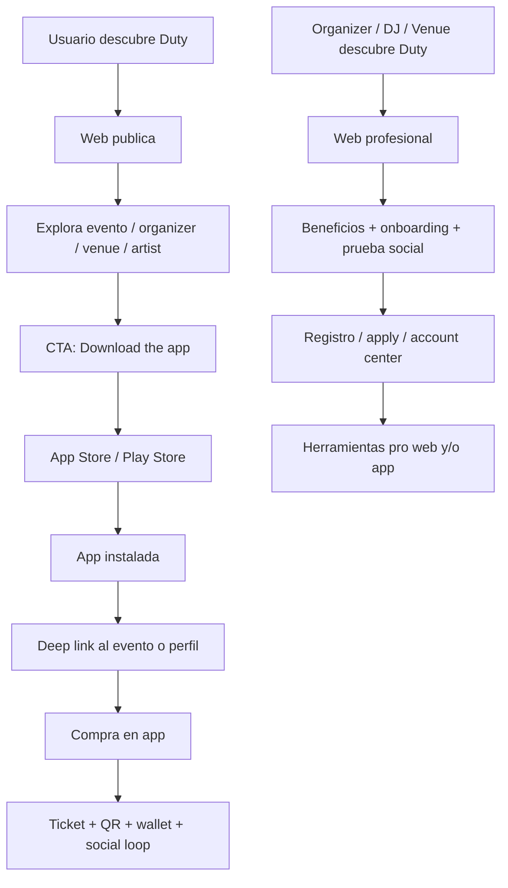

# Estrategia de Producto: Web vs App

Fecha: 2026-03-24
Estado: Base de producto activa
Decision: `App-first` para consumidores. `Web-first` para presentacion, captacion y capa profesional/publica.

## 1. Decision central

Duty debe operar con este principio:

- **La app es el producto principal para usuarios finales.**
- **La web es la capa publica, comercial y profesional del ecosistema.**

En otras palabras:

- **Browse on web**
- **Convert to app**
- **Buy on app**
- **Access on app**

## 2. Objetivo de negocio

Queremos que la experiencia del usuario final se concentre donde Duty tiene mas ventaja:

- tickets vivos
- QR de acceso
- wallet
- push
- social graph
- reservas
- follow/activity loops
- identidad persistente del usuario

Eso vive mucho mejor en la app que en la web.

Al mismo tiempo, queremos que la web funcione como:

- escaparate del producto
- capa SEO/publica
- sistema de captacion de organizers / artists / venues
- capa de confianza y presentacion
- embudo hacia la descarga de la app

## 3. Formula del producto

### Web

La web debe servir para:

1. presentar Duty
2. explicar la propuesta de valor
3. atraer nuevos usuarios
4. atraer nuevos organizers, DJs, artists y venues
5. indexar contenido publico en buscadores
6. soportar discovery y compartidos publicos
7. servir de soporte a herramientas profesionales donde escritorio tenga sentido

### App

La app debe concentrar:

1. registro/login principal del consumer
2. follow/social graph
3. compra de tickets
4. reservas y abonos
5. wallet y funding
6. tickets activos
7. acceso por QR
8. historial de actividad
9. notificaciones
10. loop social recurrente

## 4. Mapa de posicionamiento

## 5. Matriz de responsabilidades

## 5.1 Consumer

| Flujo | Web | App | Decision |
|---|---|---|---|
| Descubrir Duty | si | si | compartido |
| Ver landing y propuesta | si | no prioritario | web |
| SEO / share links de eventos | si | no | web |
| Explorar evento | si | si | compartido |
| Explorar organizer / venue / artist | si | si | compartido |
| Buscar eventos | si | si | compartido |
| Follow/social recurrente | limitado | si | app |
| Comprar ticket | no como flujo principal | si | app-only |
| Reservar boleta / abonos | no como flujo principal | si | app-only |
| Wallet / cards / topups | no | si | app-only |
| Tickets / QR / acceso | no | si | app-only |
| Historial de bookings | no | si | app-only |
| Notificaciones y reminders | no | si | app |

## 5.2 Professional

| Flujo | Web | App | Decision |
|---|---|---|---|
| Descubrir Duty como herramienta | si | opcional | web |
| Ver beneficios por rol | si | no prioritario | web |
| Apply / onboarding organizer | si | si | web-first |
| Apply / onboarding artist | si | si | web-first |
| Apply / onboarding venue | si | si | web-first |
| Crear identidad profesional | si | si | compartido |
| Gestionar eventos | si | si | compartido |
| Ver perfil publico profesional | si | si | compartido |
| Scanner operativo | no prioritario | si / app dedicada | app |
| Finanzas / retiros / paneles | si | segun modulo | web-first |
| Discovery profesional | si | si | compartido |

## 5.3 Admin / Backoffice

| Flujo | Web | App | Decision |
|---|---|---|---|
| Moderacion | si | no | web |
| Reservas / refunds / auditoria | si | no | web |
| KPIs / dashboards | si | no | web |
| Withdrawals / approvals | si | no | web |
| Configuracion | si | no | web |

## 6. Lo que la web debe ser a partir de ahora

La web ya no debe tratar de ser una version paralela de la app consumer.

Debe convertirse en 4 cosas:

### A. Marketing site
- home de producto
- propuesta de valor
- screenshots / beneficios
- como funciona Duty
- descarga de app

### B. Public discovery layer
- paginas de eventos
- paginas de organizers
- paginas de artists
- paginas de venues
- blog / contenido SEO
- city / scene pages a futuro

### C. Conversion engine hacia la app
- QR para descargar
- deep links
- "send to phone"
- CTA claro: `Get the app to unlock tickets`
- explicacion de por que el ticket vive en la app

### D. Professional acquisition + tools
- paginas `For Organizers`
- paginas `For Artists`
- paginas `For Venues`
- onboarding profesional
- acceso a paneles / herramientas donde tenga sentido usar desktop

## 7. Lo que la web NO debe intentar hacer

### No deberia seguir siendo prioridad en web:
- checkout consumer completo
- compra principal de tickets
- reservas consumer
- wallet consumer
- ticket ownership/QR consumer
- experiencia social recurrente del consumer como flujo principal

### Puede seguir existiendo temporalmente por compatibilidad:
- algunas rutas legacy de checkout
- algunas pantallas customer web ya existentes

Pero la direccion de producto no debe seguir construyendo ahi.

## 8. Regla fuerte de conversion

Las paginas publicas de evento deben responder esta pregunta:

> ¿como convierto a esta persona desde web hacia la app sin romper el impulso?

Por eso cada evento web debe tener:

1. detalle atractivo y compartible
2. valor publico suficiente para SEO/share
3. CTA claro a la app
4. transferencia suave al evento dentro de la app

## 9. Experiencia recomendada para eventos en web

### Event page web
Debe mostrar:
- poster
- fecha/hora
- venue/online
- lineup
- host
- social proof
- related events
- beneficios de comprar/acceder con la app

Debe cerrar con CTA como:
- `Download the app to unlock tickets`
- `Scan to continue on your phone`
- `Open this event in Duty`

No debe hacer que el checkout web sea la narrativa principal.

## 10. Experiencia recomendada para organizer / artist / venue

Aqui la web si debe brillar mucho.

Porque estas paginas sirven para:
- credibilidad
- SEO
- shareability
- discovery
- captacion B2B
- prueba social

Estas superficies deben sentirse como:
- perfiles publicos fuertes
- directorio profesional
- puerta de entrada a colaborar o aplicar

## 11. App-only consumer strategy

### App consumer should own:
- login principal
- onboarding principal
- follow loop
- search intensivo y recurrente
- compra
- wallet
- tickets
- QR
- reminders
- post-evento

### Implicacion
La web deja de competir con la app por retencion del consumer.

Eso simplifica mucho el producto.

## 12. Decision de diseño de copy

La web debe hablar en lenguaje de conversion y confianza.

Ejemplos:
- `Discover events. Unlock tickets in the app.`
- `Your ticket lives in Duty.`
- `Built for organizers, artists and venues.`
- `From discovery to entry, Duty happens in the app.`

## 13. Decision de arquitectura UX

### Web navigation
La navegación pública debería priorizar:
- Home
- Events
- Organizers
- Artists
- Venues
- For Organizers
- For Artists
- For Venues
- Download App

### App navigation
La app debe seguir priorizando:
- Home
- Search
- Tickets
- Marketplace / social / messages
- Profile / account center

## 14. Estado actual vs direccion nueva

## 14.1 Lo que ya ayuda a esta estrategia

### Web actual
- eventos públicos en `routes/web.php`
- perfiles públicos de organizer / artist / venue
- home pública ya rediseñada
- event listing/detail ya rediseñados

### App actual
- home social
- search
- organizer/artist/venue profiles
- checkout
- reservations
- wallet
- tickets
- account center
- professional event management

## 14.2 Lo que choca con la estrategia

### Web legacy consumer
Hoy todavía existen rutas consumer fuertes en web como:
- login/signup web customer
- dashboard customer
- bookings customer
- orders customer
- checkout web

No hace falta borrarlas hoy, pero ya no deberían marcar la dirección principal del producto consumer.

## 15. Plan recomendado de ejecución

### Fase 1. Definicion de producto
- aceptar formalmente `web = public/pro`, `app = consumer core`
- usar esta matriz como guia de decisiones

### Fase 2. Reorientacion de la web
- rediseñar home como landing app-first
- convertir event pages en paginas de conversion a app
- crear paginas dedicadas:
  - `For Organizers`
  - `For Artists`
  - `For Venues`
  - `Download App`

### Fase 3. Compatibilidad transitoria
- mantener checkout web legacy mientras definimos el corte
- empezar a bajar su protagonismo visual y de navegación

### Fase 4. App bridge
- deep links por evento/perfil
- QR hacia stores/app
- continuidad de contexto web -> app

### Fase 5. Corte final consumer
- compra consumer oficialmente app-only
- acceso/ticket oficialmente app-only

## 16. Recomendacion concreta de producto

La decisión correcta no es:

- "matar la web"

La decisión correcta es:

- **redefinir la web para que deje de ser un consumer product paralelo**
- **convertirla en la capa pública, comercial y profesional de Duty**
- **hacer que la app sea el lugar donde ocurre la experiencia real del usuario final**

## 17. Proximo bloque recomendado

El siguiente bloque más útil es:

1. traducir esta estrategia a una **matriz de flujos concretos por pantalla/ruta actual**
2. marcar cada superficie como:
   - `keep on web`
   - `web -> app bridge`
   - `app-only target`
   - `pro web`
3. usar eso para rediseñar la web con intención correcta
