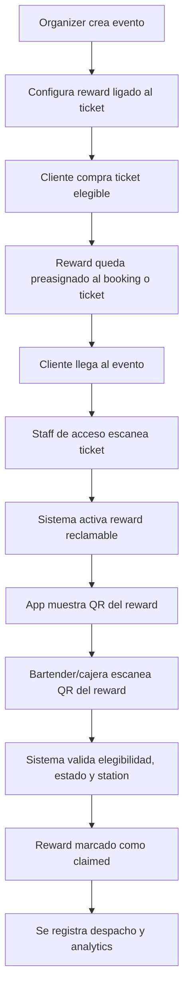
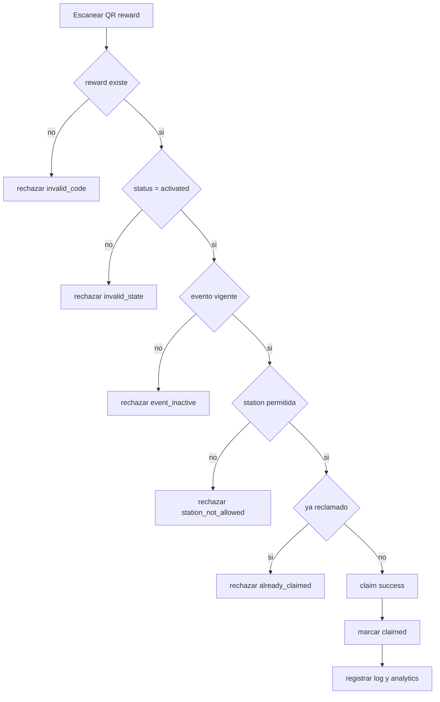
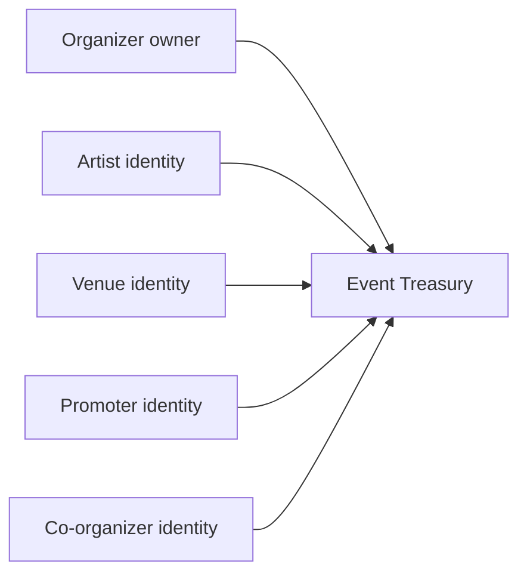
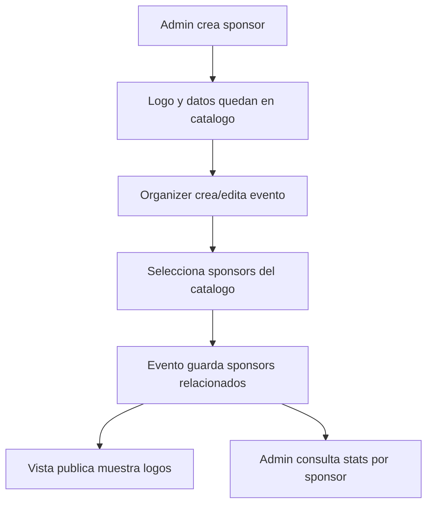
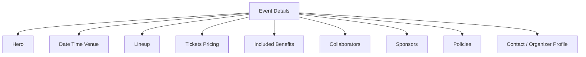

 # Nuevas Ideas y Alineacion de Producto - 2026-04-05

## Objetivo

Ordenar las nuevas ideas antes de implementar para que entren como una expansion coherente del producto, no como features aislados.

## Lectura general

Las ideas nuevas encajan muy bien con la direccion actual del proyecto si las agrupamos en 4 bloques:

1. monetizacion y perks sobre ticket
2. colaboracion profesional avanzada
3. patrocinadores y capa comercial del evento
4. simplificacion de authoring con datos estructurados

---

## 1. Ticket Add-ons / Rewards Operativos

### Idea

Permitir que el organizer agregue beneficios asociados al ticket, por ejemplo:

- welcome drink
- merch claim
- fast lane access
- meet and greet check-in
- food voucher

### Caso inicial propuesto

`Welcome drink` reclamable en bar mediante QR.

### Flujo propuesto

### Decision importante

Recomiendo que el reward **no se cree por primera vez en el bar**, sino que exista antes como instancia reservada al ticket y cambie de estado al escanear la boleta.

Estados sugeridos:

- `reserved`
- `activated`
- `claimed`
- `expired`
- `cancelled`

Eso evita fraudes, duplicados y ambiguedad operativa.

### Modelo sugerido

#### `event_reward_definitions`
Define el tipo de reward en el evento.

Campos sugeridos:
- `id`
- `event_id`
- `title`
- `reward_type`
  - `drink`
  - `voucher`
  - `perk_access`
  - `merch`
- `trigger_mode`
  - `on_ticket_scan`
  - `on_booking_completed`
  - `manual_issue`
- `fulfillment_mode`
  - `qr_claim`
  - `staff_confirmation`
- `inventory_limit`
- `per_ticket_quantity`
- `eligible_ticket_ids`
- `station_scope`
- `meta`
- `status`

#### `event_reward_instances`
Instancia por booking / ticket / unidad.

Campos sugeridos:
- `id`
- `event_id`
- `reward_definition_id`
- `booking_id`
- `ticket_id`
- `customer_id`
- `ticket_unit_key`
- `claim_code`
- `claim_qr_payload`
- `status`
- `activated_at`
- `claimed_at`
- `claimed_by_identity_id`
- `claimed_station_id`
- `meta`

#### `event_reward_claim_logs`
Auditoria operativa.

Campos sugeridos:
- `id`
- `reward_instance_id`
- `action`
  - `activated`
  - `claim_attempted`
  - `claimed`
  - `rejected`
  - `cancelled`
- `actor_identity_id`
- `station_id`
- `reason_code`
- `meta`
- `occurred_at`

### Algoritmo de validacion del claim

### UX recomendada

#### Organizer panel
Al crear/editar evento:
- seccion `Ticket Benefits` o `Rewards & Perks`
- cada reward configurable con:
  - nombre
  - tipo
  - ticket(s) elegibles
  - trigger
  - cantidad por ticket
  - estaciones permitidas
  - vigencia

#### Customer app
- en ticket details: `Benefits included`
- despues del scan del ticket: reward visible con QR
- si no esta activado aun: estado claro

#### Staff / bar app
- scanner dedicado a `reward claims`
- validacion visual fuerte:
  - verde: valido
  - rojo: invalido / ya reclamado

### Valor

Esto abre una capa muy buena de:
- add-ons operativos
- activaciones de marca
- hospitalidad
- perks VIP
- patrocinadores con beneficio incluido

---

## 2. Perfil de Promotor y Colaboraciones Avanzadas

### Idea

Agregar `promoter` como actor profesional para poder:
- colaborar en eventos
- recibir split
- figurar como colaborador visible
- operar campañas o comunidades mas adelante

### Lectura de arquitectura

Hoy ya existe economia de colaboradores y splits por evento, pero la API todavia valida `role_type` solo en:
- `artist`
- `venue`
- `organizer`

Archivo relevante:
- `/Users/monkeyinteractive/DEV/v2/app/Http/Controllers/Api/ProfessionalEventCollaboratorController.php`

### Recomendacion

No tratar al promotor como un string mas. Tratarlo como **identity profesional real**.

### Modelo objetivo

### Alcance funcional

#### V1
- `promoter` como identity type o professional subtype
- elegible en collaborator splits
- visible en editor del evento
- visible en vista publica del evento como `In collaboration with`

#### V2
- promoter dashboard propio
- links o codigos promocionales
- revenue attribution
- community building / lead capture

### Regla de reparto sugerida

El organizer define porcentajes por colaborador pertinente:
- promoters
- co-organizers
- artists
- venues si aplica

### Guardrails

- suma de porcentajes no puede romper el distributable
- si hay `fixed` + `%`, fixed primero, % sobre remanente
- co-organizer/promoter no deben poder alterar ownership del evento solo por tener split

### UI recomendada

En create/edit event:
- seccion `Collaborators & Splits`
- grupos:
  - artists
  - promoters
  - co-organizers
  - venue
- campos por fila:
  - identity
  - role
  - split type
  - split value
  - basis
  - release mode

### Visibilidad publica

En event details:
- badge o bloque:
  - `In collaboration with`
- lista corta de identities colaboradoras

---

## 3. Sponsors / Patrocinadores

### Idea

Tener un catalogo de patrocinadores administrado desde admin para que organizers puedan seleccionarlos al crear un evento.

### Objetivos

1. mostrar sponsors en event details
2. permitir seleccion en create/edit event
3. medir cuantos eventos por sponsor existen
4. dejar la puerta abierta a perks patrocinados

### Modelo sugerido

#### `sponsors`
Catalogo admin.

Campos sugeridos:
- `id`
- `name`
- `slug`
- `logo_url`
- `brand_color`
- `website_url`
- `status`
- `meta`

#### `event_sponsors`
Pivot evento-patrocinador.

Campos sugeridos:
- `id`
- `event_id`
- `sponsor_id`
- `placement`
  - `title`
  - `hero`
  - `footer`
  - `benefit_partner`
- `sort_order`
- `is_featured`
- `meta`

### Flujo sugerido

### Analytics utiles

- total eventos por sponsor
- eventos activos por sponsor
- eventos pasados por sponsor
- revenue por sponsor si luego se quiere cruzar
- rewards patrocinados reclamados por sponsor

### Sinergia con rewards

Aqui hay una union muy fuerte:
- sponsor: `Johnnie Walker`
- reward del ticket: `Welcome drink`
- station: `Bar sponsor`
- analytics: `claims por sponsor`

Eso convierte sponsors en una capa comercial medible, no solo logos decorativos.

---

## 4. Deshabilitar detalles manuales del evento

### Idea

Dejar de depender de detalles escritos manualmente y construir el detalle del evento desde informacion estructurada.

### Mi opinion

Tiene sentido, pero lo haria en dos pasos.

### Recomendacion

#### Paso 1
- esconder o despriorizar el campo manual en create/edit
- dejarlo como fallback tecnico temporal
- render del detalle usando:
  - lineup
  - venue
  - date/time
  - categories
  - perks
  - collaborators
  - sponsors
  - policies

#### Paso 2
- deshabilitar escritura manual por completo
- eventualmente generar resumen automatico si hace falta

### Riesgos si lo apagamos de golpe

- SEO o sharing con menos contexto si faltan datos estructurados
- eventos muy simples pueden verse demasiado frios si no hay copy

### Solucion equilibrada

- `manual_description_enabled = false` para organizer
- mantener campo interno solo para migracion/admin
- UI publica compuesta por modulos

### Vista objetivo del evento

---

## 5. Como alinean estas ideas entre si

Estas ideas no son separadas. Forman un sistema:

### Capa comercial
- sponsors
- promoter / co-organizer collaboration
- communities y memberships en el futuro

### Capa operativa
- rewards ligados al ticket
- claims por QR
- stations y staff scanners

### Capa financiera
- splits para collaborators
- analytics por sponsor
- rewards patrocinados
- treasury auditable

### Capa de contenido
- event details estructurado
- menos dependencia de texto manual

---

## 6. Orden recomendado de ejecucion

### Bloque 1. Rewards operativos por ticket
Porque es muy diferenciador y reutiliza base de rewards existente.

Entregables:
1. definicion de reward en organizer event form
2. activacion en ticket scan
3. QR de claim en customer app
4. scanner de bartender/cajera
5. logs + analytics

### Bloque 2. Sponsors
Porque es simple, visible y comercial.

Entregables:
1. catalogo admin de sponsors
2. seleccion en create/edit event
3. visualizacion publica
4. stats por sponsor

### Bloque 3. Promoter / co-organizer collaboration
Porque toca identity + economy y requiere mas cuidado.

Entregables:
1. actor `promoter`
2. soporte en collaborator splits
3. UI de create/edit event
4. vista publica `in collaboration with`

### Bloque 4. Event details estructurado
Porque depende de que rewards, collaborators y sponsors ya existan.

Entregables:
1. despriorizar texto manual
2. componer detalle desde modulos
3. apagar manual details para organizer

---

## 7. Plan intensivo de tiempos

### Nota honesta
Trabajar 12 horas diarias sin dias libres es posible por un tramo corto, pero sube mucho el riesgo de:
- errores tontos
- decisiones malas por fatiga
- retrabajo

Te lo organizo en modo intensivo, pero con checkpoints claros para no perder calidad.

### Propuesta agresiva

#### Semana 1
- diseno funcional cerrado
- modelos de datos
- rewards ticket MVP backend
- sponsors catalog admin backend

#### Semana 2
- organizer form para rewards y sponsors
- customer reward surface
- bar/staff reward scanner
- event details publica con sponsors

#### Semana 3
- promoter identity / collaborator support
- splits UI extendida
- `in collaboration with`
- analytics sponsor + reward claims

#### Semana 4
- event details estructurado
- apagar manual details organizer
- QA integral
- regression + smoke tests

### Version en dias de 12h

#### Dias 1-2
- definicion cerrada
- schemas
- contratos API

#### Dias 3-5
- rewards backend
- reward activation
- claim validation

#### Dias 6-7
- customer reward QR
- staff scanner reward mode

#### Dias 8-9
- sponsors admin + organizer selection

#### Dias 10-11
- sponsors en event details + stats

#### Dias 12-15
- promoter identity + collaborator support

#### Dias 16-18
- split UX extendida + collaboration visibility

#### Dias 19-21
- event details estructurado
- disable manual details

#### Dias 22-24
- QA end-to-end
- analytics
- fixes

---

## 8. Recomendacion final

Si queremos avanzar con foco, yo haria esto:

1. aprobar arquitectura de `ticket rewards`
2. aprobar arquitectura de `sponsors`
3. decidir si `promoter` sera:
   - identity type nuevo
   - o professional subtype sobre organizer
4. despues de eso, ya si entrar a implementacion

## Decision de producto que recomiendo

### Si me pides una secuencia optima
1. `Ticket Rewards`
2. `Sponsors`
3. `Promoter / co-organizer`
4. `Structured Event Details`

Porque asi cada bloque alimenta al siguiente.
