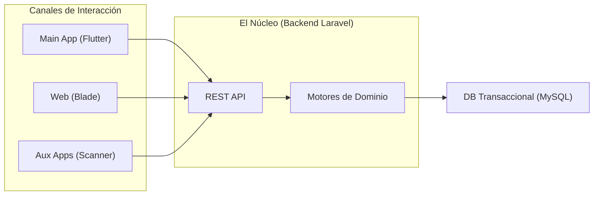

# Presentación Duty: Arquitectura y Funcionamiento por Módulos
*Documento maestro con diapositivas, sugerencias visuales y guión de apoyo para el presentador.*

---

## Slide 1: Introducción a Duty: The Big Picture
**Visión Gráfica:** Diagrama general de conectividad (Usuarios -> Canales -> Backend -> Integraciones).

**Guión del Presentador (Speaker Notes):**
> "Duty no es solo una página para vender boletos; es un ecosistema, un 'Modular Monolith' alojado en Laravel. Lo primero que debemos entender es nuestra filosofía multicanal: `App-First` para los compradores y `Web-First` para atraer público y dotar de paneles avanzados a los profesionales. Al final, todos los canales, ya sea la app móvil en Flutter donde viven los usuarios, la web en Blade, o los terminales escáner, se comunican a un mismo cerebro central de APIs."

---

## Slide 2: Identidades y Superficies de Control
**Visión Gráfica:** Esquema mostrando a una Persona común y cómo puede adquirir "Sombreros" de Organizador, Artista o Venue.

**Puntos Clave:**
*   **Customer Auth:** El punto de entrada universal. Autenticado vía `Sanctum`.
*   **Identity Context (`X-Identity-Id`):** El mecanismo mediante el cual el backend sabe si un usuario está actuando de lado personal o administrando un negocio.
*   **Multi-Guard:** Segmentación en seguridad estricta para usuarios, administradores, e islas específicas de acceso.

**Guión del Presentador:**
> "Para entender Duty, hay que entender los sombreros. Cualquier persona en nuestra plataforma inicia sesión normalmente como "Usuario". Pero la arquitectura mediante `Identity Context` le permite ponerse el sombrero de Organizador (Organizer), Artista (Artist) o Local (Venue). El sistema sabe de forma dinámica quién opera y le confiere permisos granulares sin tener que crear múltiples cuentas y contraseñas."

---

## Slide 3: El Motor Comercial: Eventos y Bookings
**Visión Gráfica:** Embudo de conversión (Publicar Evento -> Web Discovery -> App Checkout -> Activo Asignado).

**Puntos Clave:**
*   **Discovery Web & App:** Atracción generada por la web (para SEO) que direcciona a la compra dentro de la App.
*   **Checkout & Emisión Atómica:** El ticket emitido no es un PDF estático. Es un activo de Base de Datos inyectado a una Cartera de Acceso (`Booking`).
*   **Gestión por EventController:** Maneja estado de listas, validaciones de pasarela y apartados temporales.

**Guión del Presentador:**
> "El ciclo de vida de un evento comienza cuando el organizador aparta el lugar publicando el inventario. De cara a venta, somos radicales en un punto: el boleto *no existe* físicamente ni en un papel virtual. Es un activo amarrado al usuario de forma oficial. A esto en el código le llamamos Bookings. Si tu Booking está confirmado, tú eres el dueño absoluto de ese activo."

---

## Slide 4: El Sistema Financiero (Wallet, NFC y POS)
**Visión Gráfica:** Caja fuerte que interconecta Stripe, MySQL WalletTables y la Terminal de Venta (POS).

**Puntos Clave:**
*   **WalletService Independiente:** Un muro de contención en backend. Unifica el movimiento de saldos.
*   **Concurrencia (`lockForUpdate`):** Tolerancia nula ante fallos o "double-spend" en la base de datos MySQL por concurrencia.
*   **El ecosistema In-Situ (NFC + POS):** Uso de la plataforma *dentro* del evento acoplando el Wallet Digital a manillas NFC pasivas, consumiendo productos contra nuestras terminales móviles.

**Guión del Presentador:**
> "Una vez en el evento, o incluso antes, comienza el motor financiero. A través del WalletService construimos un core bancario interno que está blindado ante gastos concurrentes (es decir, evitar que se gaste dos veces los mismos 10 dólares mágicamente). Un usuario carga dinero (Topup) y dentro del recinto lo gasta apoyando una pulsera NFC en un punto de venta gestionado enteramente por nuestros propios controladores POS."

---

## Slide 5: Marketplace Primario y Secondary Ownership
**Visión Gráfica:** Flujo P2P: Transferencia de un ticket vivo del Teléfono A al Teléfono B y transacción de la bóveda de dinero.

**Puntos Clave:**
*   **El Marketplace Oficial:** Espacio para reventas transparentes reguladas por la misma Duty. 
*   **Liquidación Automática (Clearing):** En la reventa, el código realiza tres transacciones inseparables: débito de la Wallet A, crédito de la Wallet B, cambio de propietario.
*   **P2P Transfer Directo:** Opción de traspaso amigable, pendiente de aceptación o rechazo asíncrono para resguardarse del spam.

**Guión del Presentador:**
> "Si compro boletos extra, se los puedo transferir a un amigo; él deberá aceptar desde su celular. Pero si quiero venderlo, no necesito recurrir a terceros. Duty enlista el ticket y se vuelve el árbitro. En un parpadeo, debitamos la cartera del comprador nuevo, acreditamos la billetera del vendedor original y le mandamos el activo matemáticamente bloqueado al nuevo dueño. Sin PDFs falsos, sin reventas fraudulentas."

---

## Slide 6: Scanner Module (Operación en Puerta)
**Visión Gráfica:** El "handshake" entre el código QR de un móvil y el láser del organizador verificándolo en la BBDD remota.

**Puntos Clave:**
*   **Ruteo Paralelo (`/api/scanner/`):** API desconectada de la web convencional, hiper optimizada para validar rápido.
*   **Tolerancia a Descuadres de Seguridad:** `admin_sanctum` vs `organizer_sanctum` provee autenticación asilada (sin revelar a la puerta los datos financieros del evento completo).
*   **Mutación Terminal del Estado:** El consumo de un `scanning` deja el `scan_status=1`. Invalida la recarga posterior para siempre en esa boleta.

**Guión del Presentador:**
> "La validación final, la última milla, pasa en la puerta. Hemos dotado a nuestro módulo Scanner de su propia autopista de red (APIs exclusivas). Cuando la portería escruta un QR frente al teléfono del portador, cambian los registros irrevocablemente; el acceso se confirma y ese QR se torna papel triturado de inmediato para evitar clonaciones de repetición táctica."

---

## Slide 7: Engagement Module (Red Social, Chat, Shop)
**Visión Gráfica:** Red de conexiones (Usuario -> Sigue -> Artista/Venue), Mensajería.

**Puntos Clave:**
*   **Sistema Follow Polimórfico:** Red Social nativa, bases de datos optimizadas con modelo de "Followers, Favorites".
*   **Protocolo de Intercomunicación (Chat API):** Conversaciones uno-a-uno o modulares incrustadas para pre/post evento. 
*   **Marketplace Adicional (Shop):** Las compras pueden extenderse a camisetas o material para consumo post-show, empujado por la misma aplicación móvil.

**Guión del Presentador:**
> "La experiencia de Duty no muere cuando salimos del lugar. Creamos una retención altísima mediante nuestro Social Graph. Sigues a Organizadores, te enteras de dónde toca mañana el Artista que viste ayer, y hasta se abren micro-chats en contexto a tus adquisiciones. Generamos un bucle en el cual la App es siempre relevante los 365 días."

---

## Slide 8: Visión Técnica (Next Steps y Estabilidad)
**Visión Gráfica:** Roadmap y escudos de seguridad.

**Puntos Clave:**
*   **La Revolución "Actor-Type":** Unificación arquitectónica. Ya no se trata de `user_id`, toda tabla se vuelve inteligente y se referenciará a un `actor` (persona, dj, antro). 
*   **Solución de Cargas Legadas (Technical Debt):** Migración oficial del remanente histórico del ecosistema web checkout hacia `App-First` puritano.
*   **Hardening (Endurecimiento) Constante:** El plan agresivo final sobre resolución de cuellos de botella (rutas obsoletas del proveedor *MyFatoorah*, mitigación de secretos expuestos, y fortalecimiento de endpoints).

**Guión del Presentador:**
> "Cerramos conociendo nuestro horizonte corporativo interno. Tecnológicamente venimos migrando de usuarios simples al universo *Role-Based/Actor-Type*, un rediseño radical de los cimientos. A esto le sumamos el compromiso de cerrar la brecha transicional "Buy on App", erradicando lo que queda de checkout en la web para hacer inviolable el modelo móvil, pagando la deuda técnica residual en el trayecto para una estructura de datos intachable."
